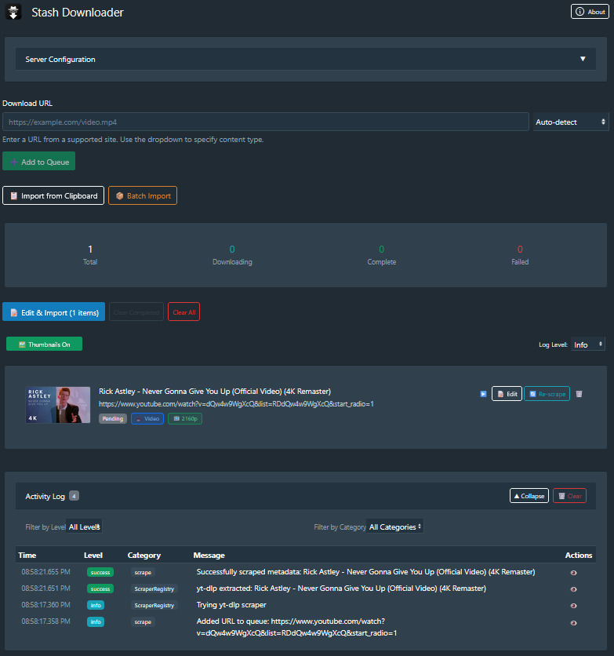
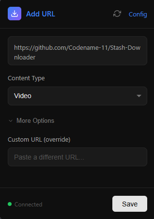

<div align="center">
  
  <h1>Stash Downloader</h1>
  <p>Download videos and images directly to your Stash library with automatic metadata extraction</p>

  [](LICENSE)
  [](https://github.com/Codename-11/Stash-Downloader/releases)
  [](https://github.com/Codename-11/Stash-Downloader/actions)
  [](https://github.com/stashapp/stash)
  [](https://discourse.stashapp.cc/t/stash-downloader-download-videos-images-with-metadata-extraction)

  [](https://ko-fi.com/codename_11)
</div>

## Features

- **URL-based Downloads** - Paste URLs to download videos and images
- **Automatic Metadata** - Extracts titles, thumbnails, performers, tags, studio via yt-dlp
- **Editable Metadata** - Review and edit performers, tags, studio before import
- **Cover Images** - Scraped thumbnails automatically set as scene covers
- **Browser Extension** - Right-click any link to send directly to your queue
- **Batch Import** - Import multiple URLs from clipboard
- **Post-Import Actions** - Choose how Stash handles metadata after import:
  - **Identify** - Match via StashDB fingerprints + installed scrapers
  - **Scrape URL** - Use Stash's scrapers for the source URL
  - **None** - Just import, edit metadata in Stash later
- **Auto-Create** - Missing performers/tags/studios automatically created in Stash
- **Queue Management** - Track downloads with progress indicators
- **Persistent Queue** - Queue survives page refresh and navigation



---

## Browser Extension

Send URLs directly to your Stash Downloader queue from any webpage.



### Features

- **Right-click menu** - Send links, images, videos, or highlighted text
- **Real-time updates** - URLs appear instantly in open Stash tabs
- **Content type selection** - Choose Video, Image, or Gallery
- **Popup interface** - Quick access to send current page URL

### Installation

**Firefox Add-ons (Coming Soon)**

The extension is currently pending review on [Firefox Add-ons](https://addons.mozilla.org/). Once approved, you'll be able to install it directly from the store.

**Manual Installation (Temporary)**

1. Open Firefox and navigate to `about:debugging`
2. Click "This Firefox" → "Load Temporary Add-on"
3. Select `browser-extension/manifest.json`

Note: Temporary add-ons are removed when Firefox closes.

### Setup

1. Click the extension icon → gear icon (or right-click → Options)
2. Enter your Stash URL (e.g., `http://localhost:9999`)
3. Add API key if authentication is enabled
4. Click "Save Settings"

### Usage

- **Right-click a link** → "Send to Stash Downloader" → "As Video/Image/Gallery"
- **Highlight a URL** → Right-click → "Send to Stash Downloader"
- **Click extension icon** → Send current page URL

The URL is added to your Stash Downloader queue automatically.

---

## Plugin Installation

### Quick Install (Recommended)

1. In Stash: **Settings** → **Plugins** → **Available Plugins**
2. Click **"Add Source"**
3. Enter: `https://codename-11.github.io/Stash-Downloader/index.yml`
4. Find "Stash Downloader" and click **"Install"**

### Requirements

- Stash v0.20+
- Python 3.7+ with yt-dlp (`pip install yt-dlp`)

See [Installation Guide](docs/INSTALLATION.md) for manual installation and Docker setup.

---

## Quick Start

1. Navigate to `http://your-stash-url/plugin/stash-downloader`
2. Paste a URL and click "Add to Queue"
3. Click "Edit" to review metadata
4. Click "Save & Import to Stash"

See [Usage Guide](docs/USAGE.md) for detailed workflows.

---

## Configuration

Configure in Stash at **Settings** → **Plugins** → **Stash Downloader**:

| Setting | Description |
|---------|-------------|
| **Server Download Path** | Where to save files (default: `/data/StashDownloader`) |
| **HTTP Proxy** | Proxy for geo-restricted content (`http://`, `socks5://`) |
| **Concurrent Downloads** | Max simultaneous downloads (default: 3) |
| **Auto-Create** | Automatically create performers/tags/studios |
| **Download Quality** | Preferred video quality |

> **Note**: Video downloads support SOCKS proxies via yt-dlp. Cover image fetching will fall back to direct connection if PySocks isn't installed (image CDNs typically don't require proxies).

---
## Feedback & Support

Have questions, ideas, or need help?  
- **Stash Forums**: Join the discussion and get support  
  [](https://discourse.stashapp.cc/t/stash-downloader-download-videos-images-with-metadata-extraction)
- **GitHub Issues**: [Report bugs or request features](https://github.com/Codename-11/Stash-Downloader/issues)

We welcome all feedback—thanks for helping improve Stash Downloader! 

---

## Troubleshooting

**yt-dlp not working?**
```bash
pip install -U yt-dlp  # Update to latest
```

**Docker users:**
```bash
docker exec -it stash pip install -U yt-dlp --break-system-packages
```

See [Troubleshooting Guide](docs/TROUBLESHOOTING.md) for more solutions.

---

## Development

```bash
npm install        # Install dependencies
npm run dev        # Build with watch mode
npm run build      # Production build
```

See [Development Guide](docs/DEVELOPMENT.md) for architecture and contribution guidelines.

---

## Links

- [Installation Guide](docs/INSTALLATION.md)
- [Usage Guide](docs/USAGE.md)
- [Troubleshooting](docs/TROUBLESHOOTING.md)
- [Development](docs/DEVELOPMENT.md)
- [GitHub Issues](https://github.com/Codename-11/Stash-Downloader/issues)
- [Stash Forums](https://discourse.stashapp.cc/t/stash-downloader-download-videos-images-with-metadata-extraction)

---

## License

MIT License - see [LICENSE](LICENSE) file

---

<div align="center">
  Built with ❤️ by <a href="https://github.com/Codename-11">Codename-11</a> and 🤖 Claude Code
</div>
